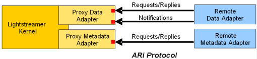

# Lightstreamer - "Hello World" Tutorial - Node.js Adapter #
<!-- START DESCRIPTION lightstreamer-example-helloworld-adapter-node -->

This article will focus on a Node.js port of the Java Data Adapter illustrated in [Lightstreamer - "Hello World" Tutorial - Java Adapter](https://github.com/Weswit/Lightstreamer-example-HelloWorld-adapter-java). 

As example of [Clients Using This Adapter](https://github.com/Weswit/Lightstreamer-example-HelloWorld-adapter-node#clients-using-this-adapter), you may refer to the [Lightstreamer - "Hello World" Tutorial - HTML Client](https://github.com/Weswit/Lightstreamer-example-HelloWorld-client-javascript) and view the corresponding [Live Demo](http://demos.lightstreamer.com/HelloWorld/).

## Detail

First, please take a look at the previous installment [Lightstreamer - "Hello World" Tutorial - HTML Client](https://github.com/Weswit/Lightstreamer-example-HelloWorld-client-javascript), which provides some background and the general description of the application. Notice that the front-end will be exactly the same. We created a very simple HTML page that subscribes to the "greetings" item, using the "HELLOWORLD" Adapter. Now, we will replace the "HELLOWORLD" Adapter implementation based on Java with a JavaScript equivalent. On the client side, nothing will change, as server-side Adapters can be transparently switched and changed, as long as they respect the same interfaces. Thanks to this decoupling provided by Lightstreamer Server, we could even do something different. For example, we could keep the Java Adapter on the server side and use Flex, instead of HTML, on the client side. Or we could use the Node.js Adapter on the server side and use Java, instead of HMTL or Flex, on the client side. Basically, all the combinations of languages and technologies on the client side and on the server side are supported.

### Node.js Interfaces

Lightstreamer Server exposes native Java Adapter interfaces. The Node.js interfaces are added through the **Lightstreamer Adapter Remoting Infrastructure** (ARI). Let's have a look at it.



ARI is simply made up of two Proxy Adapters and a **Network Protocol**. The two Proxy Adapters implement the Java interfaces and are meant to be plugged into Lightstreamer Kernel, exactly as we did for our original "HELLOWORLD" Java Adapter. There are two Proxy Adapters because one implements the Data Adapter interface and the other implements the Metadata Adapter interface. Our "Hello World" example uses a default Metadata Adapter, so we only need the **Proxy Data Adapter**.

What does the Proxy Data Adapter do? Basically, it exposes the Data Adapter interface through TCP sockets. In other words, it offers a Network Protocol, which any remote counterpart can implement to behave as a Lightstreamer Data Adapter. This means you can write a remote Data Adapter in C, in PHP, or in COBOL (?!?), provided that you have access to plain TCP sockets.

But - here is some magic - if your remote Data Adapter is based on Node.js, you can forget about direct socket programming, and leverage a ready-made library that exposes a higher level **JavaScript interface**. So, you will simply have to implement this JavaScript interface.

Ok, let's recap... The Proxy Data Adapter converts from a Java interface to TCP sockets. The Node.js library converts from TCP sockets to a JavaScript interface. Clear enough?

You may find more details about ARI in [Adapter Remoting Infrastructure Network Protocol Specification](http://www.lightstreamer.com/latest/Lightstreamer_Allegro-Presto-Vivace_5_1_Colosseo/Lightstreamer/DOCS-SDKs/sdk_adapter_remoting_infrastructure/doc/ARI%20Protocol.pdf).
You may find more details about how to write Data Adapters and Metadata Adapters for Lightstreamer Server in a Node.js environment in [Lightstreamer SDK for Node Adapters](https://github.com/Weswit/Lightstreamer-lib-node-adapter).
The full Node.js Adapter API Reference covered in this tutorial are available at [Lightstreamer Node.js Adapter SDK 1.0.1 API](http://www.lightstreamer.com/docs/adapter_nodejs_api/index.html).

<!-- END DESCRIPTION lightstreamer-example-helloworld-adapter-node -->

### Dig the Code

#### The JavaScript Data Adapter

The `helloworld.js` file containing all the required JavaScript code.

First we include the modules we need and setup some configuration variables

```js
var DataProvider = require('lightstreamer-adapter').DataProvider;
var net = require('net');

var HOST = 'localhost';
var REQ_RESP_PORT = 6663;
var WRITE_PORT = 6664;
```

Then we create two streams that will be used by our DataProvider to communicate with the Proxy Data Adapter. We use the standard net module to do so:
```js
var reqRespStream = net.createConnection(REQ_RESP_PORT, HOST);
var notifyStream = net.createConnection(WRITE_PORT, HOST);
```

Finally we create our DataProvider instance
```js
var dataProvider = new DataProvider(reqRespStream, notifyStream);
```

At this point the application is kind of ready-ish. It doesn't do anything but "it works".

Now we want to handle the DataProvider events to listen for subscribe/unsubscribe calls and start generating real-time events.

```js
var greetingsThread;

dataProvider.on('subscribe', function(itemName, response) {
  if (itemName === "greetings") {
    greetingsThread = setTimeout(generateGreetings,0);
    response.success();    
  }
});

dataProvider.on('unsubscribe', function(itemName, response) {
  console.log("Unsubscribed item: " + itemName);
  if (itemName === "greetings") {
    clearTimeout(greetingsThread);
    response.success();
  } 
});

var c = false;
function generateGreetings() {
  c = !c;
  dataProvider.update("greetings", false, {
    'timestamp': new Date().toLocaleString(),
    'message': c ? "Hello" : "World"
  });
  greetingsThread = setTimeout(generateGreetings,1000+Math.round(Math.random()*2000));
}
```

When the "greetings" item is subscribed to by the first user, the Adapter receives the **subscribe** event and starts generating the real-time data. 
If more users subscribe to the "greetings" item, the subscribe event is not fired anymore. 
When the last user unsubscribes from this item, the Adapter is notified through the **unsubscribe** event. In this case we stop the generating events for that item. 
If a new user re-subscribes to "greetings", the subscribe event is fired again. 
As already mentioned in the previous installment, this approach avoids consuming processing power for items nobody is currently interested in.

The **greetingsThread** function is responsible for generating the real-time events. 
Its code is very simple. We simply call the dataProvider.update method passing in the item name we want to update and a JSON object representing our update containing a message (alternating "Hello" and "World") and the current timestamp. 
The function then calls itself using setTimeout to wait for a random time between 1 and 3 seconds and generate the next event..

#### The Adapter Set Configuration

This Adapter Set Name is configured and will be referenced by the clients as `NODE_HELLOWORLD`.
For this demo we configure just the Data Adapter as a *Proxy Data Adapter*, while instead, as Metadata Adapter, we use the ready-made [LiteralBasedProvider](https://github.com/Weswit/Lightstreamer-example-ReusableMetadata-adapter-java).
As *Proxy Data Adapter* you may configure also the robust versions. The *Robust Proxy Data Adapter* has some recovery capabilities and avoid to terminate the Lightstreamer Server process, so it can handle the case in which a Remote Data Adapter is missing or fails, by suspending the data flow and trying to connect to a new Remote Data Adapter instance. Full details on the recovery behavior of the Robust Data Adapter are available as inline comments within the `DOCS-SDKs/sdk_adapter_remoting_infrastructure/conf/sockets(robust)/adapters.xml` file in your Lightstreamer Server installation.

The `adapters.xml` file for this demo should look like:
```xml
<?xml version="1.0"?>
 
<adapters_conf id="NODE_HELLOWORLD">
 
  <metadata_provider>
    <adapter_class>com.lightstreamer.adapters.metadata.LiteralBasedProvider</adapter_class>
  </metadata_provider>
 
  <data_provider>
    <adapter_class>com.lightstreamer.adapters.remote.data.NetworkedDataProvider</adapter_class>
    <param name="request_reply_port">6663</param>
    <param name="notify_port">6664</param>
  </data_provider>
 
</adapters_conf>
```

## Install
If you want to install a version of this demo in your local Lightstreamer Server, follow these steps.
* Download *Lightstreamer Server* (Lightstreamer Server comes with a free non-expiring demo license for 20 connected users) from [Lightstreamer Download page](http://www.lightstreamer.com/download.htm), and install it, as explained in the `GETTING_STARTED.TXT` file in the installation home directory.
* Get the `deploy.zip` file for the Lightstreamer version you have installed from [releases](https://github.com/Weswit/Lightstreamer-example-HelloWorld-adapter-node/releases) and unzip it, obtaining the `deployment` folder.
* Plug the Proxy Data Adapter into the Server: go to the `deployment/Deployment_LS` folder and copy the `NodeHelloWorld` directory and all of its files to the `adapters` folder of your Lightstreamer Server installation.
* Alternatively you may plug the *robust* versions of the Proxy Data Adapter: go to the `deployment/Deployment_LS(robust)` folder and copy the `NodeHelloWorld` directory and all of its files into `adapters`.
* Install the lightstreamer-adapter module. 
    * Create a directory where to deploy the Node.js Remote Adapter and let call it `Deployment_Node_Remote_Adapter`.
    * Go to the `Deployment_Node_Remote_Adapter` folder and launch the command:<BR/>
    `> npm install lightstreamer-adapter`<BR/>
    * Download the `helloworld.js` file from this project and copy it into the `Deployment_Node_Remote_Adapter` folder.
* Launch Lightstreamer Server. The Server startup will complete only after a successful connection between the Proxy Data Adapter and the Remote Data Adapter.
* Launch the Node.js Remote Adapter: go to the `Deployment_Node_Remote_Adapter` folder and launch:<BR/>
`> node helloworld.js`<BR/>
* Test the Adapter, launching the client listed in [Clients Using This Adapter](https://github.com/Weswit/Lightstreamer-example-HelloWorld-adapter-node#clients-using-this-adapter).
    * In order to make the ["Hello World" Tutorial - HTML Client](https://github.com/Weswit/Lightstreamer-example-HelloWorld-client-javascript) front-end pages get data from the newly installed Adapter Set, you need to modify the front-end pages and set the required Adapter Set name to NODE_HELLOWORLD, when creating the LightstreamerClient instance. So edit the `index.htm` page of the Hello World front-end, deployed under `Lightstreamer/pages/HelloWorld`, and replace:<BR/>
`var client = new LightstreamerClient(null," HELLOWORLD");`<BR/>
with:<BR/>
`var client = new LightstreamerClient(null,"NODE_HELLOWORLD");;`<BR/>
    * Open a browser window and go to: [http://localhost:8080/HelloWorld/]()

## See Also

### Clients Using This Adapter
<!-- START RELATED_ENTRIES -->

* [Lightstreamer - "Hello World" Tutorial - HTML Client](https://github.com/Weswit/Lightstreamer-example-HelloWorld-client-javascript)

<!-- END RELATED_ENTRIES -->

### Related Projects

* [Lightstreamer - "Hello World" Tutorial - Java Adapter](https://github.com/Weswit/Lightstreamer-example-HelloWorld-adapter-java)
* [Lightstreamer - "Hello World" Tutorial - .NET Adapter](https://github.com/Weswit/Lightstreamer-example-HelloWorld-adapter-dotnet)
* [Lightstreamer - Reusable Metadata Adapters - Java Adapter](https://github.com/Weswit/Lightstreamer-example-ReusableMetadata-adapter-java)

## Lightstreamer Compatibility Notes

- Compatible with Lightstreamer Node.js Adapter API version 1 or newer.

## Final Notes

Please [post to our support forums](http://forums.lightstreamer.com) any feedback or question you might have. Thanks!

